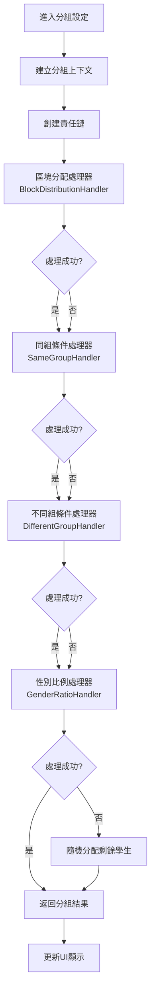
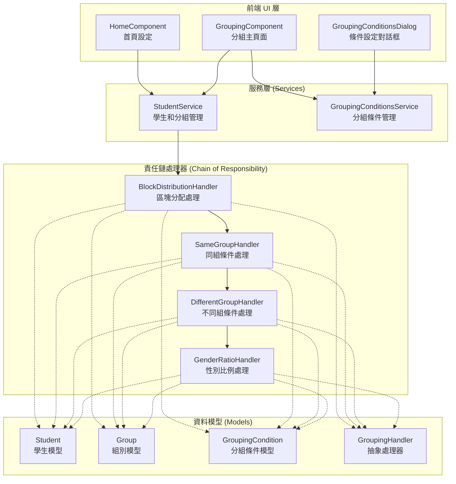
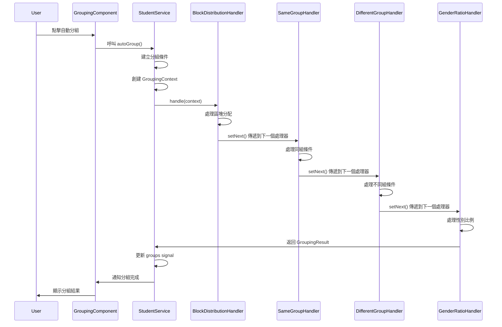
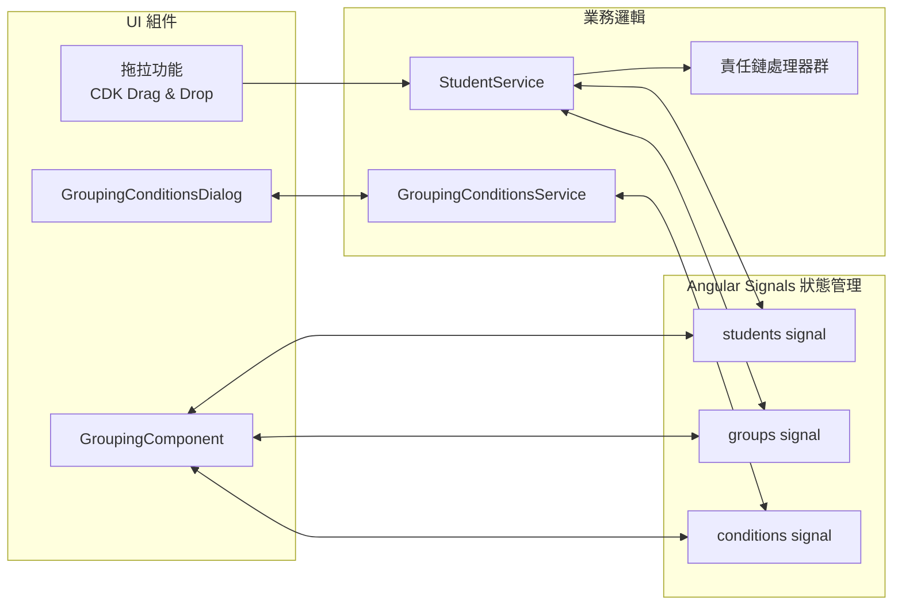

# TeamShuffle 架構圖

## 責任鏈模式 (Chain of Responsibility Pattern) 流程圖

```mermaid
graph TD
    A[進入分組設定] --> B[建立分組上下文]
    B --> C[創建責任鏈]

    C --> D[區塊分配處理器<br/>BlockDistributionHandler]
    D --> E{處理成功?}
    E -->|是| F[同組條件處理器<br/>SameGroupHandler]
    E -->|否| F

    F --> G{處理成功?}
    G -->|是| H[不同組條件處理器<br/>DifferentGroupHandler]
    G -->|否| H

    H --> I{處理成功?}
    I -->|是| J[性別比例處理器<br/>GenderRatioHandler]
    I -->|否| J

    J --> K{處理成功?}
    K -->|是| L[返回分組結果]
    K -->|否| M[隨機分配剩餘學生]
    M --> L

    L --> N[更新UI顯示]
```

## 系統架構圖

```mermaid
graph TB
    subgraph "前端 UI 層"
        A[HomeComponent<br/>首頁設定]
        B[GroupingComponent<br/>分組主頁面]
        C[GroupingConditionsDialog<br/>條件設定對話框]
    end

    subgraph "服務層 (Services)"
        D[StudentService<br/>學生和分組管理]
        E[GroupingConditionsService<br/>分組條件管理]
    end

    subgraph "責任鏈處理器 (Chain of Responsibility)"
        F[BlockDistributionHandler<br/>區塊分配處理]
        G[SameGroupHandler<br/>同組條件處理]
        H[DifferentGroupHandler<br/>不同組條件處理]
        I[GenderRatioHandler<br/>性別比例處理]

        F --> G
        G --> H
        H --> I
    end

    subgraph "資料模型 (Models)"
        J[Student<br/>學生模型]
        K[Group<br/>組別模型]
        L[GroupingCondition<br/>分組條件模型]
        M[GroupingHandler<br/>抽象處理器]
    end

    A --> D
    B --> D
    B --> E
    C --> E

    D --> F

    F -.-> J
    G -.-> J
    H -.-> J
    I -.-> J

    F -.-> K
    G -.-> K
    H -.-> K
    I -.-> K

    F -.-> L
    G -.-> L
    H -.-> L
    I -.-> L

    F -.-> M
    G -.-> M
    H -.-> M
    I -.-> M
```

## 資料流程圖

```mermaid
sequenceDiagram
    participant U as User
    participant GC as GroupingComponent
    participant SS as StudentService
    participant BD as BlockDistributionHandler
    participant SG as SameGroupHandler
    participant DG as DifferentGroupHandler
    participant GR as GenderRatioHandler

    U->>GC: 點擊自動分組
    GC->>SS: 呼叫 autoGroup()
    SS->>SS: 建立分組條件
    SS->>SS: 創建 GroupingContext

    SS->>BD: handle(context)
    BD->>BD: 處理區塊分配
    BD->>SG: setNext() 傳遞到下一個處理器

    SG->>SG: 處理同組條件
    SG->>DG: setNext() 傳遞到下一個處理器

    DG->>DG: 處理不同組條件
    DG->>GR: setNext() 傳遞到下一個處理器

    GR->>GR: 處理性別比例
    GR->>SS: 返回 GroupingResult

    SS->>SS: 更新 groups signal
    SS->>GC: 通知分組完成
    GC->>U: 顯示分組結果
```

## 組件互動圖

```mermaid
graph LR
    subgraph "Angular Signals 狀態管理"
        A[students signal]
        B[groups signal]
        C[conditions signal]
    end

    subgraph "UI 組件"
        D[GroupingComponent]
        E[GroupingConditionsDialog]
        F[拖拉功能<br/>CDK Drag & Drop]
    end

    subgraph "業務邏輯"
        G[StudentService]
        H[GroupingConditionsService]
        I[責任鏈處理器群]
    end

    D <--> A
    D <--> B
    D <--> C
    E <--> H
    F --> G
    G --> I
    G <--> A
    G <--> B
    H <--> C
```
