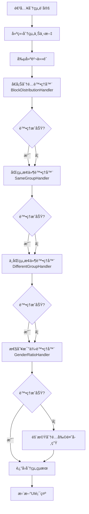
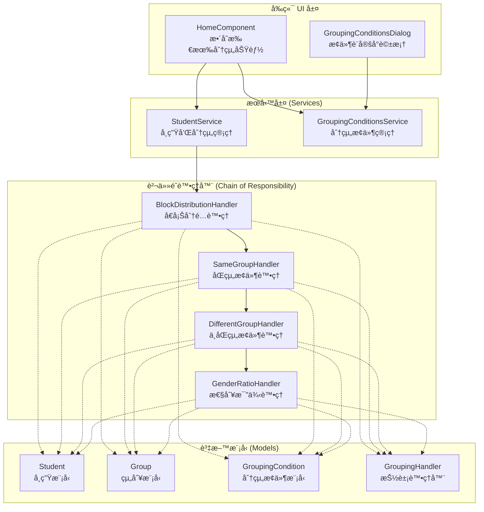
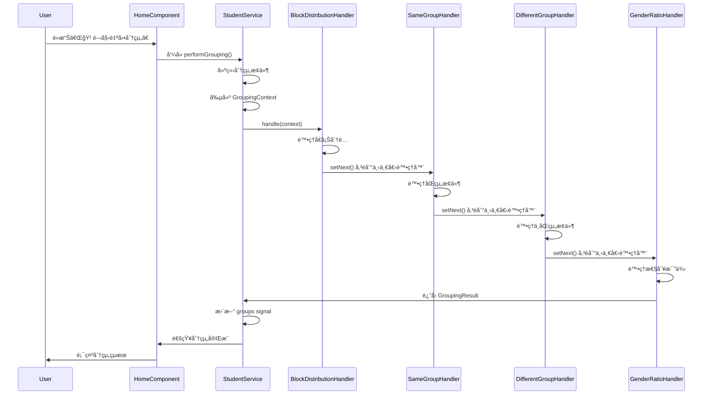
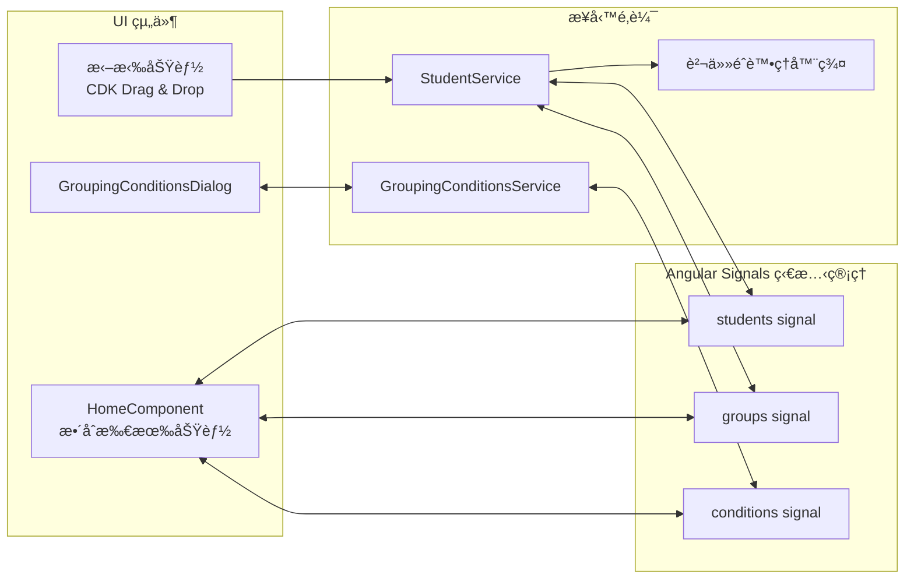

# TeamShuffle æ¶æ§‹åœ–

## 責任éˆæ¨¡å¼ (Chain of Responsibility Pattern) æµç¨‹åœ–

```mermaid
graph TD
    A[進入分組設定] --> B[建立分組上下文]
    B --> C[創建責任éˆ]

    C --> D[å€å¡Šåˆ†é…處ç†å™¨<br/>BlockDistributionHandler]
    D --> E{處ç†æˆåŠŸ?}
    E -->|是| F[åŒçµ„æ¢ä»¶è™•ç†å™¨<br/>SameGroupHandler]
    E -->|å¦| F

    F --> G{處ç†æˆåŠŸ?}
    G -->|是| H[ä¸åŒçµ„æ¢ä»¶è™•ç†å™¨<br/>DifferentGroupHandler]
    G -->|å¦| H

    H --> I{處ç†æˆåŠŸ?}
    I -->|是| J[性別比例處ç†å™¨<br/>GenderRatioHandler]
    I -->|å¦| J

    J --> K{處ç†æˆåŠŸ?}
    K -->|是| L[è¿”å›åˆ†çµ„çµæœ]
    K -->|å¦| M[隨機分é…剩餘學生]
    M --> L

    L --> N[更新UI顯示]
```

## 系統æ¶æ§‹åœ–

```mermaid
graph TB
    subgraph "å‰ç«¯ UI 層"
        A[HomeComponent<br/>æ•´åˆæ‰€æœ‰åˆ†çµ„功能]
        C[GroupingConditionsDialog<br/>æ¢ä»¶è¨­å®šå°è©±æ¡†]
    end

    subgraph "æœå‹™å±¤ (Services)"
        D[StudentService<br/>學生和分組管ç†]
        E[GroupingConditionsService<br/>分組æ¢ä»¶ç®¡ç†]
    end

    subgraph "責任éˆè™•ç†å™¨ (Chain of Responsibility)"
        F[BlockDistributionHandler<br/>å€å¡Šåˆ†é…處ç†]
        G[SameGroupHandler<br/>åŒçµ„æ¢ä»¶è™•ç†]
        H[DifferentGroupHandler<br/>ä¸åŒçµ„æ¢ä»¶è™•ç†]
        I[GenderRatioHandler<br/>性別比例處ç†]

        F --> G
        G --> H
        H --> I
    end

    subgraph "è³‡æ–™æ¨¡å‹ (Models)"
        J[Student<br/>學生模å‹]
        K[Group<br/>組別模å‹]
        L[GroupingCondition<br/>分組æ¢ä»¶æ¨¡å‹]
        M[GroupingHandler<br/>抽象處ç†å™¨]
    end

    A --> D
    A --> E
    C --> E

    D --> F

    F -.-> J
    G -.-> J
    H -.-> J
    I -.-> J

    F -.-> K
    G -.-> K
    H -.-> K
    I -.-> K

    F -.-> L
    G -.-> L
    H -.-> L
    I -.-> L

    F -.-> M
    G -.-> M
    H -.-> M
    I -.-> M
```

## 資料æµç¨‹åœ–

```mermaid
sequenceDiagram
    participant U as User
    participant HC as HomeComponent
    participant SS as StudentService
    participant BD as BlockDistributionHandler
    participant SG as SameGroupHandler
    participant DG as DifferentGroupHandler
    participant GR as GenderRatioHandler

    U->>HC: é»æ“Šã€ŒğŸ² 開始自動分組ã€
    HC->>SS: å‘¼å« performGrouping()
    SS->>SS: 建立分組æ¢ä»¶
    SS->>SS: 創建 GroupingContext

    SS->>BD: handle(context)
    BD->>BD: 處ç†å€å¡Šåˆ†é…
    BD->>SG: setNext() 傳é到下一個處ç†å™¨

    SG->>SG: 處ç†åŒçµ„æ¢ä»¶
    SG->>DG: setNext() 傳é到下一個處ç†å™¨

    DG->>DG: 處ç†ä¸åŒçµ„æ¢ä»¶
    DG->>GR: setNext() 傳é到下一個處ç†å™¨

    GR->>GR: 處ç†æ€§åˆ¥æ¯”例
    GR->>SS: è¿”å› GroupingResult

    SS->>SS: æ›´æ–° groups signal
    SS->>HC: 通知分組完æˆ
    HC->>U: 顯示分組çµæœ
```

## 組件互動圖

```mermaid
graph LR
    subgraph "Angular Signals 狀態管ç†"
        A[students signal]
        B[groups signal]
        C[conditions signal]
    end

    subgraph "UI 組件"
        D[HomeComponent<br/>æ•´åˆæ‰€æœ‰åŠŸèƒ½]
        E[GroupingConditionsDialog]
        F[拖拉功能<br/>CDK Drag & Drop]
    end

    subgraph "業務é‚輯"
        G[StudentService]
        H[GroupingConditionsService]
        I[責任éˆè™•ç†å™¨ç¾¤]
    end

    D <--> A
    D <--> B
    D <--> C
    E <--> H
    F --> G
    G --> I
    G <--> A
    G <--> B
    H <--> C
```
