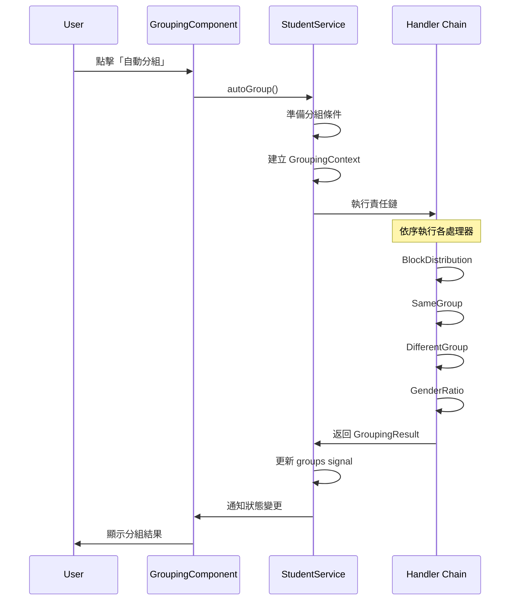
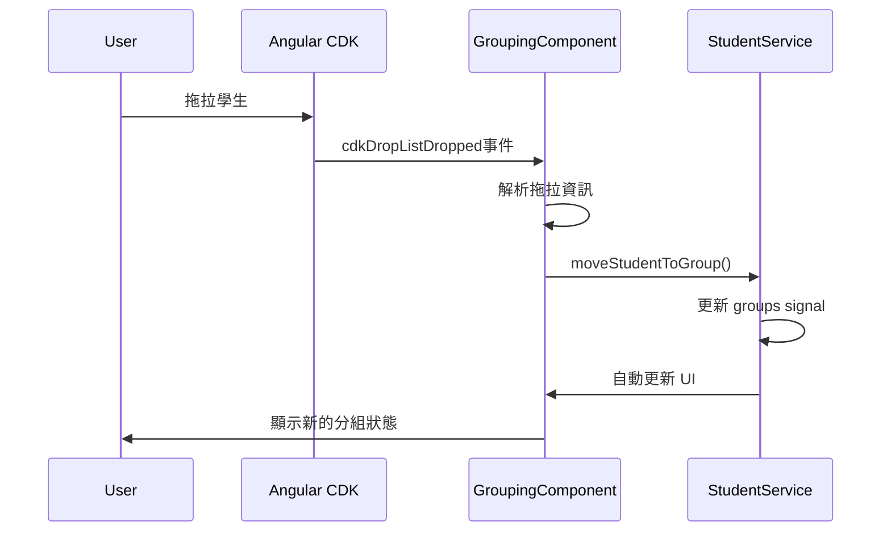

# TeamShuffle 技術文檔

## 目錄

1. [系統架構概述](#系統架構概述)
2. [責任鏈模式詳解](#責任鏈模式詳解)
3. [核心組件說明](#核心組件說明)
4. [資料流程](#資料流程)
5. [擴展指南](#擴展指南)

## 系統架構概述

TeamShuffle 採用現代化的 Angular 20 架構，結合設計模式實現高度可擴展的分組系統。

### 架構層次

```
┌─────────────────────────────────────┐
│           展示層 (Presentation)      │
│  - Angular Components              │
│  - Material UI + Tailwind CSS     │
│  - Drag & Drop Interactions       │
└─────────────────────────────────────┘
                    │
┌─────────────────────────────────────┐
│            服務層 (Services)        │
│  - StudentService                  │
│  - GroupingConditionsService       │
│  - Angular Signals 狀態管理        │
└─────────────────────────────────────┘
                    │
┌─────────────────────────────────────┐
│          業務邏輯層 (Business)       │
│  - Chain of Responsibility         │
│  - Grouping Handlers               │
│  - Algorithm Implementations       │
└─────────────────────────────────────┘
                    │
┌─────────────────────────────────────┐
│           資料層 (Data Models)      │
│  - Student, Group, Condition       │
│  - TypeScript Interfaces           │
│  - Type Safety                     │
└─────────────────────────────────────┘
```

## 責任鏈模式詳解

### 設計原理

責任鏈模式允許多個處理器按順序處理請求，每個處理器都有機會處理請求或將其傳遞給下一個處理器。

### 核心抽象類

```typescript
export abstract class GroupingHandler {
  protected nextHandler?: GroupingHandler;

  // 設定下一個處理器
  public setNext(handler: GroupingHandler): GroupingHandler {
    this.nextHandler = handler;
    return handler;
  }

  // 處理請求的主要方法
  public handle(context: GroupingContext): GroupingResult {
    const result = this.process(context);

    // 如果處理失敗且有下一個處理器，則傳遞
    if (!result.success && this.nextHandler) {
      return this.nextHandler.handle(context);
    }

    return result;
  }

  // 子類必須實現的具體處理邏輯
  protected abstract process(context: GroupingContext): GroupingResult;
}
```

### 處理器實現

#### 1. BlockDistributionHandler (區塊分配處理器)

**職責**: 將學生按座位區塊平均分配到各組

**邏輯**:

- 解析區塊輸入 (如 "1-10,11-20,21-30")
- 將每個區塊的學生平均分配到各組
- 確保每組都有來自不同區塊的學生

```typescript
export class BlockDistributionHandler extends GroupingHandler {
  protected process(context: GroupingContext): GroupingResult {
    // 1. 檢查區塊分配條件是否啟用
    // 2. 解析區塊輸入
    // 3. 按區塊分組學生
    // 4. 平均分配到各組
    // 5. 返回處理結果
  }
}
```

#### 2. SameGroupHandler (同組條件處理器)

**職責**: 確保指定的學生被分配到同一組

**邏輯**:

- 解析同組輸入 (如 "1-2,3-4-5" 表示 1 和 2 同組，3、4、5 同組)
- 為每個同組條件分配一個組別
- 處理已分配的學生避免衝突

#### 3. DifferentGroupHandler (不同組條件處理器)

**職責**: 確保指定的學生不會被分配到同一組

**邏輯**:

- 解析不同組輸入 (如 "1-2,3-4" 表示 1 和 2 不同組，3 和 4 不同組)
- 檢查已分配的學生位置
- 調整分配避免衝突

#### 4. GenderRatioHandler (性別比例處理器)

**職責**: 平衡各組的男女比例

**邏輯**:

- 計算理想的男女比例
- 按比例分配剩餘學生
- 支援自訂比例設定

### 責任鏈建立

```typescript
// StudentService 中的分組方法
autoGroup(): void {
  // 建立處理器實例
  const blockDistributionHandler = new BlockDistributionHandler();
  const sameGroupHandler = new SameGroupHandler();
  const differentGroupHandler = new DifferentGroupHandler();
  const genderRatioHandler = new GenderRatioHandler();

  // 設置責任鏈 (優先級順序)
  blockDistributionHandler.setNext(sameGroupHandler);
  sameGroupHandler.setNext(differentGroupHandler);
  differentGroupHandler.setNext(genderRatioHandler);

  // 建立分組上下文
  const context: GroupingContext = {
    students: [...this.students()],
    groups: this.createEmptyGroups(),
    conditions: this.getEnabledConditions(),
    remainingStudents: [...this.students()]
  };

  // 執行責任鏈處理
  const result = blockDistributionHandler.handle(context);

  // 更新結果到 UI
  this.updateGroupsFromResult(result);
}
```

## 核心組件說明

### StudentService

**職責**: 學生和分組的核心管理服務

**主要功能**:

- 學生資料管理 (新增、移除、更新)
- 分組邏輯執行
- 責任鏈協調
- 狀態管理 (使用 Signals)

**重要方法**:

```typescript
class StudentService {
  // Signals 狀態
  private studentsSignal = signal<Student[]>([]);
  private groupsSignal = signal<Group[]>([]);

  // 公開的只讀 computed
  students = this.studentsSignal.asReadonly();
  groups = this.groupsSignal.asReadonly();

  // 核心方法
  addStudents(input: string, gender: "male" | "female"): void;
  removeStudent(studentId: number): void;
  autoGroup(): void;
  moveStudentToGroup(
    studentId: number,
    fromGroupId: string,
    toGroupId: string
  ): void;
}
```

### GroupingConditionsService

**職責**: 分組條件的管理和狀態維護

**主要功能**:

- 條件的啟用/停用
- 條件參數設定
- 對話框狀態管理
- 條件驗證

### GroupingComponent

**職責**: 主要的分組 UI 組件

**主要功能**:

- 學生列表顯示
- 分組結果展示
- 拖拉功能
- 條件設定對話框
- 組長指定功能

## 資料流程

### 分組執行流程



### 拖拉功能流程



## 擴展指南

### 新增分組處理器

1. **建立處理器類別**:

```typescript
export class CustomHandler extends GroupingHandler {
  protected process(context: GroupingContext): GroupingResult {
    // 檢查是否需要處理這個條件
    const condition = context.conditions.find(
      (c) => c.type === "custom" && c.enabled
    );
    if (!condition) {
      return {
        success: false,
        groups: context.groups,
        handled: false,
        remainingStudents: context.remainingStudents,
        message: "Custom condition not enabled",
      };
    }

    // 實現自訂邏輯
    const processedGroups = this.applyCustomLogic(context);

    return {
      success: true,
      groups: processedGroups,
      handled: true,
      remainingStudents: [],
      message: "Custom grouping applied successfully",
    };
  }

  private applyCustomLogic(context: GroupingContext): Group[] {
    // 實現具體的分組邏輯
    return context.groups;
  }
}
```

2. **更新責任鏈**:

```typescript
// 在 StudentService 的 autoGroup 方法中
const customHandler = new CustomHandler();

// 插入到適當位置
sameGroupHandler.setNext(customHandler);
customHandler.setNext(differentGroupHandler);
```

3. **新增條件類型**:

```typescript
// 在 student.model.ts 中更新
export interface GroupingCondition {
  type:
    | "same-group"
    | "different-group"
    | "gender-ratio"
    | "block-distribution"
    | "custom";
  // ...其他屬性
}
```

### 新增 UI 組件

1. **使用 Angular CLI**:

```bash
bun run ng generate component components/new-feature --standalone --style=scss
```

2. **遵循專案約定**:

- 使用外部 HTML 和 SCSS 檔案
- 匯入 Angular Material 組件
- 使用 Signals 進行狀態管理
- 應用 Tailwind CSS 樣式

### 新增服務

1. **建立服務**:

```bash
bun run ng generate service services/new-service
```

2. **使用 Signals**:

```typescript
@Injectable({ providedIn: "root" })
export class NewService {
  private dataSignal = signal<DataType[]>([]);

  // 公開只讀 computed
  data = this.dataSignal.asReadonly();

  // 提供更新方法
  updateData(newData: DataType[]): void {
    this.dataSignal.set(newData);
  }
}
```

## 效能考量

### Signals 最佳化

- 使用 `computed()` 進行衍生狀態計算
- 避免在模板中進行複雜計算
- 適當使用 `asReadonly()` 防止意外修改

### 拖拉功能最佳化

- 使用 CDK Virtual Scrolling 處理大量學生
- 實現延遲載入避免初始化效能問題
- 適當的 change detection 策略

### 責任鏈最佳化

- 早期返回避免不必要的處理
- 快取處理結果避免重複計算
- 使用策略模式進一步最佳化特定場景
